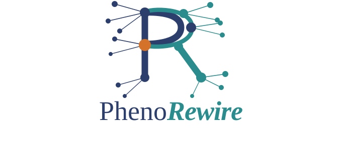

<p align="center">
  
</p>

<p align="center">
  <a href="LICENSE"></a>
  <a href="https://www.python.org/downloads/"></a>
  <a href="https://github.com/ldellavedova/PhenoRewire/actions/workflows/tests.yml"></a>
</p>

# PhenoRewire

**Detect metabolites that change not only in abundance, but in how they co-regulate with the rest of the metabolome.**

PhenoRewire is a Python command-line tool for phenotype-aware metabolomics network rewiring. It identifies features whose correlation neighbourhood reorganises between biological states, providing a complementary signal to differential abundance and helping reveal coordinated metabolic shifts that standard analyses may miss.

> **Status:** in active development. Intended for research use. Feedback, issues, and pull requests are welcome.

---

## What is PhenoRewire?

Many metabolomics studies focus on which metabolites go up or down between groups. PhenoRewire asks a different question: *did the way metabolites co-vary with each other change?*

Given a feature table, sample metadata, and a configuration file, PhenoRewire:

1. selects metabolite features statistically associated with a phenotype or time contrast
2. builds one Spearman correlation network per biological state
3. quantifies rewiring edge by edge — identifying connections gained, lost, or reversed between states
4. ranks features by how much their correlation context changed
5. exports GraphML networks for Cytoscape and CSV tables for spreadsheet review

PhenoRewire is intended for hypothesis generation. It identifies correlational reorganisation, not causal mechanisms.

---

## Why use it?

A metabolite can show substantial rewiring with no significant change in mean abundance, and vice versa. These two signals are complementary. Rewiring analysis is particularly useful when:

- classical differential abundance yields long lists with no clear priorities
- you suspect coordinated metabolic shifts that are not visible at the individual-feature level
- you want to identify hub metabolites whose co-regulation context changes between groups or timepoints

PhenoRewire is not a replacement for differential abundance. It is a complementary tool for hypothesis generation and candidate prioritisation.

---

## What do you get?

After a standard run, the key outputs are:

| Output | Location | Description |
|--------|----------|-------------|
| `priority_rewired_nodes.csv` | `triage/` | Ranked list of the most rewired metabolites |
| `rewiring_summary.csv` | `triage/` | Global rewiring counts for the entire comparison |
| `rewiring_network_phenotype.graphml` | `triage/` | Full rewiring network for Cytoscape (phenotype mode) |
| `rewiring_network_temporal.graphml` | `triage/` | Full rewiring network for Cytoscape (temporal mode) |
| `final_report.md` | `report/` | Narrative run summary with scoring formulas and a reproducibility block |

Optional 2D annotation outputs (with `--run-2dnetwork`):

| Output | Location | Description |
|--------|----------|-------------|
| `annotation_summary.csv` | `2dnetwork/` | One row per prioritised feature with neighbour counts and annotation confidence |
| `annotation_expansion.csv` | `2dnetwork/` | One row per (feature, neighbour) pair across the molecular network |
| `annotation_first_neighbours.csv` | `2dnetwork/` | First-hop neighbours only |

For column definitions and interpretation guidance, see [`docs/interpret_phenotype.md`](docs/interpret_phenotype.md), [`docs/interpret_temporal.md`](docs/interpret_temporal.md), and [`docs/interpret_2d_network.md`](docs/interpret_2d_network.md).

---

## Installation

PhenoRewire installs from this repository. It is not yet available on PyPI.

### Conda (recommended)

```bash
git clone https://github.com/ldellavedova/PhenoRewire
cd PhenoRewire
conda env create -f environment.yml
conda activate phenorewire
pip install -e .
phenorewire --help
```

`environment.yml` pins Python 3.11. The package metadata supports Python `>=3.9`.

### venv alternative

```bash
git clone https://github.com/ldellavedova/PhenoRewire
cd PhenoRewire
python -m venv .venv

# Linux / macOS
source .venv/bin/activate

# Windows PowerShell
.venv\Scripts\Activate.ps1

pip install --upgrade pip
pip install -e .
phenorewire --help
```

### Optional plotting extras

Required for `--plot-networks` and the standalone 2D figure script:

```bash
pip install "phenorewire[viz]"
```

---

## Quick start

The repository includes synthetic example data in `data/` and ready-to-use configs at the repository root. Output files are written to `results/` locally; this directory is gitignored and not committed.

### Phenotype comparison

```bash
phenorewire --config config_phenotype.yaml
```

Output directory: `results/phenotype_example/`

Key outputs:
- `results/phenotype_example/triage/priority_rewired_nodes.csv`
- `results/phenotype_example/triage/rewiring_network_phenotype.graphml`
- `results/phenotype_example/report/final_report.md`

### Temporal comparison

`config_temporal.yaml` is a ready-to-use template for temporal (time-course) data. The bundled synthetic data was designed for the phenotype mode and does not contain a meaningful temporal signal, so running this command with the demo data will exit early at the feature selection step. Use `config_temporal.yaml` as the starting point for your own time-course dataset.

```bash
phenorewire --config config_temporal.yaml
```

### 2D molecular network annotation

The bundled phenotype config also points to a small demo molecular network:

```bash
phenorewire --config config_phenotype.yaml --run-2dnetwork
```

Expected outputs in `results/phenotype_example/2dnetwork/`:
- `annotation_summary.csv`
- `annotation_expansion.csv`
- `annotation_first_neighbours.csv`

See [`docs/interpret_2d_network.md`](docs/interpret_2d_network.md) and [`2d_network/README.md`](2d_network/README.md) for the standalone publication-figure workflow.

---

## Input files

### `feature_table.csv`

One row per metabolite feature. The column names are configurable; the bundled example uses:

| Column | Example name | Config key |
|--------|-------------|------------|
| Feature identifier | `feature_id` | `FEATURE_ID_COL` |
| m/z | `mz` | `MZ_COL` |
| Retention time | `rt` | `RT_COL` |
| Name (optional) | `name` | `NAME_COL` |
| Sample intensities | `Sample_001`, `Sample_002`, … | detected by `INTENSITY_REGEX` |

### `metadata.csv`

One row per sample. The column names are configurable; the bundled example uses:

| Column | Example name | Config key |
|--------|-------------|------------|
| Sample identifier | `sample_id` | `META_SAMPLE_COL` |
| Group or phenotype | `group_label` | used in `GROUP_DEFINITION` |
| Timepoint | `timepoint` | `META_TIME_COL` |

Sample identifiers in `metadata.csv` must match the intensity column names in `feature_table.csv`, after stripping any prefix or suffix handled by `INTENSITY_REGEX`.

---

## Configuration

Use `config_phenotype.yaml` for phenotype comparisons and `config_temporal.yaml` for temporal comparisons. Both files are fully annotated templates — copy one, edit the paths and group labels, and run. All available parameters are documented inline in the config files.

The technical parameter reference is in [`docs/architecture.md`](docs/architecture.md).

---

## Documentation

Full documentation is in [`docs/`](docs/README.md):

| Doc | Description |
|-----|-------------|
| [`docs/interpret_phenotype.md`](docs/interpret_phenotype.md) | Output column definitions — phenotype mode |
| [`docs/interpret_temporal.md`](docs/interpret_temporal.md) | Output column definitions — temporal mode |
| [`docs/interpret_2d_network.md`](docs/interpret_2d_network.md) | Output column definitions — 2D annotation |
| [`docs/architecture.md`](docs/architecture.md) | Technical architecture and module overview |
| [`docs/troubleshooting.md`](docs/troubleshooting.md) | Common problems and fixes |
| [`docs/tutorials/`](docs/tutorials/README.md) | Step-by-step tutorial notebooks and walkthrough |

---

## Repository structure

| Path | Description |
|------|-------------|
| `phenorewire/` | Installable Python package and CLI entry point |
| `phenorewire/twodn/` | 2D molecular network annotation and plotting helpers |
| `docs/` | User and technical documentation |
| `docs/tutorials/` | Tutorial notebooks and output walkthrough |
| `data/` | Bundled synthetic example inputs |
| `2d_network/` | Standalone two-layer figure workflow |
| `dev/tests/` | Unit and integration test suite |
| `dev/benchmarks/` | Performance benchmarking scripts |
| `dev/simulate/` | Parameter sensitivity simulations |
| `config_phenotype.yaml` | Ready-to-run phenotype config template |
| `config_temporal.yaml` | Ready-to-run temporal config template |
| `environment.yml` | Conda environment specification |

---

## Citation

> **Note:** PhenoRewire has not yet been formally published. If you use this tool in a manuscript, please check this repository for an updated citation. In the meantime, please cite the repository URL and version (v0.1.1).

<!-- TODO: add DOI and update this section when the manuscript is submitted or published -->

---

## License

[MIT License](LICENSE) — free to use, modify, and distribute with attribution.

---

## Contributing

Contributions are welcome. To report a bug or request a feature, open an issue on GitHub. See [CONTRIBUTING.md](CONTRIBUTING.md) for code contribution guidelines.

---

## Contact

For questions or feedback, open an issue on GitHub or contact the maintainer at [l.dellavedova@uu.nl](mailto:l.dellavedova@uu.nl).
