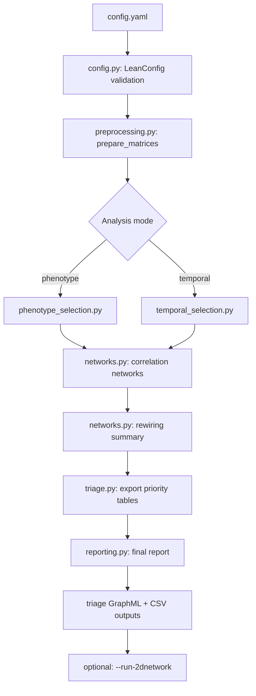

# PhenoRewire Architecture Reference

This document is the technical companion to `README.md`. The README is the user-facing source of truth; this file gives a code-aligned overview of how the repository is organized and how the main outputs are produced.

---

## 1. Purpose

PhenoRewire is a hypothesis-generating metabolomics workflow for detecting network rewiring between two comparable biological states.

Conceptually, the pipeline has three stages:

1. **Selection**: identify features associated with phenotype or time
2. **Network construction**: build one correlation network per state
3. **Rewiring analysis**: compare those networks and rank the features whose network context changed the most

It is not a causal inference framework, a differential abundance package, or a machine-learning classifier.

---

## 2. Repository structure

| Path | Role |
|------|------|
| `phenorewire/` | Installable Python package and CLI |
| `phenorewire/twodn/` | Reusable 2D annotation and plotting helpers |
| `2d_network/` | Optional standalone two-layer figure workflow |
| `docs/` | User and technical documentation |
| `data/` | Bundled example inputs, including a small demo molecular network |
| `dev/tests/` | Unit and integration tests |

---

## 3. Main execution flow

The CLI entrypoint is `phenorewire/cli.py`. The top-level orchestration lives in `phenorewire/run.py`.



In code terms:

1. `phenorewire/config.py` validates the YAML config with `LeanConfig`
2. `phenorewire/preprocessing.py` filters and normalizes the feature matrix
3. `phenorewire/phenotype_selection.py` or `phenorewire/temporal_selection.py` selects features
4. `phenorewire/networks.py` builds per-state correlation networks
5. `phenorewire/networks.py` computes rewiring across the two state-specific networks
6. `phenorewire/triage.py` writes ranking tables
7. `phenorewire/reporting.py` writes the final report
8. optionally, `phenorewire/twodn/chemical_integration.py` performs neighbourhood-based molecular-network annotation expansion

---

## 4. Core modules

### `phenorewire/config.py`

Defines `LeanConfig`, the validated run configuration.

Important groups of parameters:

- input/output paths
- analysis mode
- feature-table and metadata column names
- selection thresholds
- network thresholds
- rewiring and triage settings
- optional 2D annotation settings:
  - `SPECREBOOT_NETWORK`
  - `PHENOREWIRE_NETWORK`
  - `MN_HOP_DEPTH`
  - `MN_MIN_COSINE`
  - `ANNOTATION_TOP_N`

### `phenorewire/preprocessing.py`

`prepare_matrices(...)`:

- detects intensity columns using `INTENSITY_REGEX`
- aligns matrix sample names to metadata sample IDs
- applies presence filtering
- applies median normalization
- applies optional `log2(x + 1)`
- removes zero-variance features

### `phenorewire/phenotype_selection.py`

Performs phenotype-associated feature selection using correlation to the binary phenotype label plus multiple-testing correction.

### `phenorewire/temporal_selection.py`

Performs temporal feature selection using correlation to the time variable within the chosen phenotype subset.

### `phenorewire/networks.py`

Contains the main network logic:

- `correlation_network(...)`
- `compute_network_metrics(...)`
- `compute_rewiring(...)`
- `summarize_rewiring(...)`
- `export_network(...)`
- `export_rewiring_network(...)`

Correlation networks are undirected `networkx.Graph` objects derived from thresholded Spearman correlations.

### `phenorewire/triage.py`

Contains two distinct ranking/export paths:

- `export_network_triage(...)`
  - writes `priority_features.csv`
  - ranks features by `triage_score`
- `export_rewiring_triage(...)`
  - writes `priority_rewired_nodes.csv`
  - ranks features by `rewiring_score`

This distinction matters: `priority_features.csv` and `priority_rewired_nodes.csv` are not the same table and are not sorted by the same criterion.

### `phenorewire/twodn/chemical_integration.py`

Implements the package-integrated 2D annotation workflow used by:

```bash
phenorewire --config config_phenotype.yaml --run-2dnetwork
```

This module:

- loads the rewiring GraphML and an external molecular network GraphML
- takes the top PhenoRewire-prioritized features
- searches `k`-hop neighbours in the molecular network
- filters traversed edges by a cosine/similarity threshold
- writes CSV tables summarizing suggested annotations from local neighbourhoods

It is a neighbourhood-based annotation expansion workflow, not a PageRank, diffusion, or random-walk implementation.

---

## 5. Output semantics

### `priority_features.csv`

- produced by `export_network_triage(...)`
- ranks features by `triage_score`
- emphasizes a combination of topology and phenotype/time association support

### `priority_rewired_nodes.csv`

- produced by `export_rewiring_triage(...)`
- sorted by `rewiring_score`, then `sign_switch_edges`, then `feature_id`
- emphasizes features whose correlation neighbourhood changed the most between states

This is the main user-facing rewiring ranking table described in `README.md`.

### `rewiring_score`

The code computes:

```text
rewiring_score =
    state_A_only_edges
  + state_B_only_edges
  + sign_switch_edges
```

Higher values mean more rewired local context.

### `rewiring_fraction`

The code computes:

```text
rewiring_fraction =
    (state_A_only_edges + state_B_only_edges) / total_union_degree
```

This normalizes state-specific rewiring by total connectivity.

### `triage_score`

The code computes:

```text
triage_score =
    TRIAGE_TOPOLOGY_WEIGHT * topology_priority_score
  + TRIAGE_SELECTION_WEIGHT * selection_support_score
```

This score is used in `priority_features.csv`, not for ordering `priority_rewired_nodes.csv`.

---

## 6. Output files

Paths below are relative to the configured `OUTDIR`.

| File | Typical location | Meaning |
|------|------------------|---------|
| `priority_features.csv` | `network_<group>/triage/` | Network-level ranking by `triage_score` |
| `priority_rewired_nodes.csv` | `rewiring_*/triage/` and copied into `triage/` | Rewiring ranking by `rewiring_score` |
| `rewiring_summary.csv` | `rewiring_*/triage/` and copied into `triage/` | Global rewiring counts |
| `rewiring_network_phenotype.graphml` | `triage/` | Phenotype-mode rewiring graph |
| `rewiring_network_temporal.graphml` | `triage/` | Temporal-mode rewiring graph |
| `final_report.md` | `report/` and copied into `triage/` | Run summary |

---

## 7. 2D molecular network annotation

PhenoRewire has two related 2D workflows.

### A. Package-integrated annotation workflow

Run:

```bash
phenorewire --config config_phenotype.yaml --run-2dnetwork
```

Purpose:

- start from PhenoRewire-prioritized rewired features
- search annotated neighbours in an external molecular/chemical similarity network
- suggest annotations from local `k`-hop neighbourhoods
- write CSV outputs for downstream review

Required inputs:

1. a rewiring GraphML from the PhenoRewire run
2. an external molecular network GraphML
3. matching node IDs between the rewiring network and molecular network
4. a usable edge similarity attribute such as `cosine`
5. node annotation attributes such as `consensus_annotation`

Key config fields:

- `SPECREBOOT_NETWORK`
- `PHENOREWIRE_NETWORK`
- `MN_HOP_DEPTH`
- `MN_MIN_COSINE`
- `ANNOTATION_TOP_N`

Main outputs:

- `annotation_summary.csv`
- `annotation_expansion.csv`
- `annotation_first_neighbours.csv`
- `subnetworks/*.graphml`

The current implementation uses breadth-first neighbourhood traversal over an undirected graph and computes:

```text
annotation_confidence = annotated_neighbours / total_reachable_neighbours
```

### B. Standalone figure workflow

Run:

```bash
python 2d_network/multilayer_2d_notebook.py --config 2d_network/2d_figure_phenotype.yaml
```

This workflow is optional and is mainly for generating the two-layer figure. It is separate from the package-integrated CSV annotation workflow.

Plotting extras:

```bash
pip install "phenorewire[viz]"
```

---

## 8. Notes for reviewers

- The README is intentionally the primary public install and usage document.
- `priority_rewired_nodes.csv` should be described as rewiring-ranked, not triage-ranked.
- The package-integrated 2D workflow is table-oriented first; the standalone `2d_network/` script is figure-oriented.
